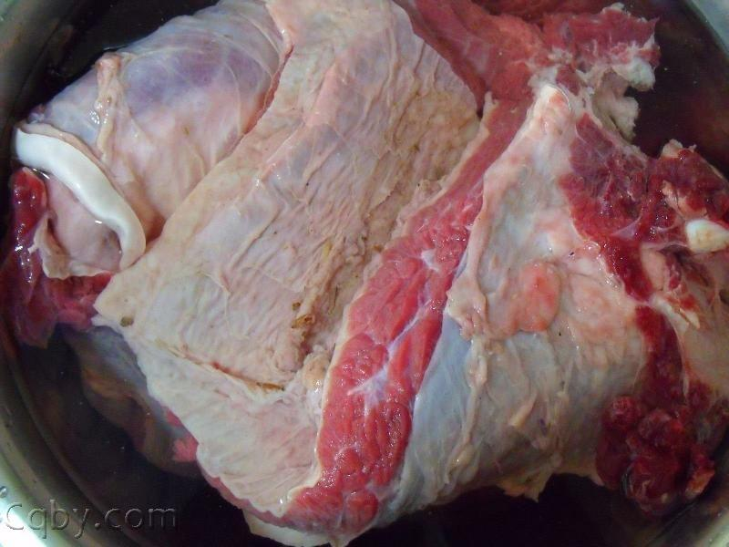
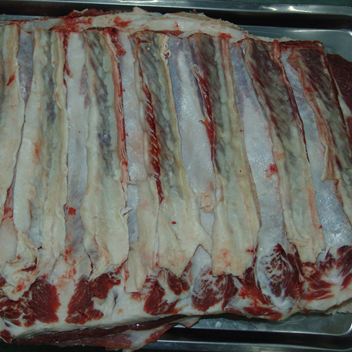
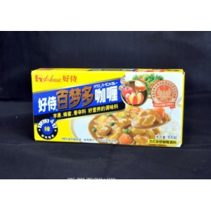

咖喱牛肉
======================
## 食材 ##
* 牛肉：一定要选**腰窝**和**牛腩**

牛腩

腰窝

* 圆葱
* 胡萝卜
* 咖喱块

## 做法 ##
1. 牛肉切块儿，焯一下（冷水下肉，水沸两分钟后撇掉血水和沫子)捞出备用。
2. 将圆葱，胡萝卜，土豆切块备用。（刀工好的话可以和焯牛肉的同时进行节约时间）
3. 冷锅，下油，油开后下圆葱爆锅，加牛肉，放入盐翻炒两下。加水大火炖。
4. 水沸后，放入咖喱块，中火炖20-40分钟。
 * 时间根据肉质和肉块的大小决定
 * 水量保证炖的时候不要糊锅（一般没过牛肉块，就可以）如果不够后期可以再补水。
 * 火候很重要，中火慢炖可以保证牛肉入味。
 * 咖喱块的数量一般是两块儿，可依据个人口味和食材的多少，自行增减。
5. 开锅放胡萝卜块和土豆块，大火炖至水沸后转中火慢炖20分钟。
 * 观察水量，水少的话可以补些水进去
 * 中火慢炖保证土豆块和胡萝卜块入味。
6. 开锅换大火收汤至粘稠状出锅。
 * 喜多汁或怕糊锅的新手，可略过此步骤，直接出锅。
 * 如果炖的时间较短，土豆没有碎，可边收汤，边把土豆用铲子捣碎，这样会更加粘稠入味。

