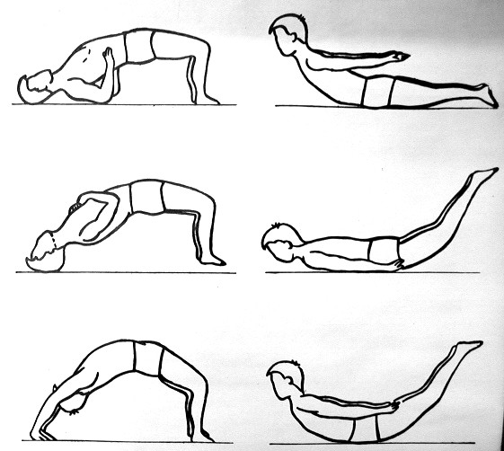

## 腰肌劳损 ##

1. 仰卧保健法:患者取仰卧位,首先双脚、双肘和头部五点,支撑于床上,将腰、背、臀和下肢用力挺起稍离开床面,维持感到疲劳时,再恢复平静的仰卧位休息。按此法反复进行 10分钟左右,每天早晚各锻炼一次。

2. 俯卧保健法:患者采取俯卧位,将双上肢反放在背后,然后用力将头胸部和双腿用力挺起离开床面,使身体呈反弓型,坚持至稍感疲劳为止。依此法反复锻炼 10分钟左右,每天早晚各一次。如果长期坚持锻炼,可预防和治疗腰肌劳损和低头综合症的发生和发展。

3. 叩击按摩法:患者采用端坐位,先用左手握空拳,用左拳在左侧腰部自上而下。轻轻叩击 10分钟后,再用左手掌上下按摩或揉搓 5分钟左右,一日两次。然后反过来用右手同左手运动法。自己感到按摩区有灼热感,则效果更好,运动后自觉舒服无比。此运动法能促使腰部血液循环,能解除腰肌的痉挛和疲劳,对防治中老年性腰肌劳损效果良好。

4. 热敷或理疗:每天晚上可用热水袋或热疗灵在疼痛部位热敷,也可用麸皮 1. 5公斤,在铁锅内炒糊后,再加食醋 0. 25公斤速搅拌均匀后,装入自制布袋内,然后放置在腰痛部位用被子盖好保暖热敷。有条件的家庭可自购远红外线热疗器或周林频谱仪等理疗。此法能促进腰部血液循环,还能祛风湿、活血通络,对治疗腰肌劳损患者效果良好。

5. 药物疗法:对腰肌劳损患者,有明显压痛点者可用强的松龙针1毫升加 1%普鲁卡因 5毫升,作压痛点封闭,每周一次, 3次为一疗程。待腰痛减轻后即可开始进行腰锻炼。也可口服药物通痹片或壮骨关节丸、肠溶阿司匹林和消炎痛等治疗,以巩固治疗效果和防止腰痛再发。

6. 摇动腰部也能够防治腰肌劳损。具体介绍两种方法，以供参考：

 1. 转胯运腰。站立姿势，双手叉腰，拇指在前，其余四指在后，中指按在腰眼部，即中医所说的肾穴位上，吸气时，将胯由左向右摆动，呼气时，由右向左摆动，一呼一吸为一次，可连续做8—32次。

 2. 旋腰转背。取站立姿势，两手上举至头两侧与肩同宽，拇指尖与眉同高，手心相对。吸气时，上体由左向右扭转，头也随着向后扭转，呼气时，由右向左扭动，一呼一吸为一次，可连续做8—32次。
