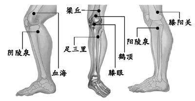

## 英语 ##
fast asleep 熟睡
ladder 梯子
shed 棚子
sareastic 讽刺的
tone 语气，强调

I got a ladder from the shed.

## 膝关节自我按摩的方法六个步 ##

1. 点揉压痛点

这个很简单，在膝关节病的时候，在膝关节周围容易出现一些压痛点，一般在内侧或者外侧
有，我们在找到内侧和外侧压痛点的时候，我们要用拇指进行点揉。所谓的压痛点就是说在
膝关节周围，我们在用拇指触摸的时候，有一些部位比较疼痛，这叫压痛点，这个部位往往
就是病变的所在。 

按摩手法：我们找到压痛点以后，可以用拇指由轻到重进行按揉，有酸胀感最合适，每个
压痛点大约一分钟左右，三到四个压痛点就是三到四分钟就可以了。 

作用：第一个可以促进局部血液循环，也可以有一定的止痛作用。 

2. 点揉膝关节五个穴位

一个叫阳陵泉，一个叫阴陵泉，一个叫梁丘，一个叫血海，另外一个是足三里。 

穴位位置：血海穴非常好找，我们把膝关节绷紧，膝关节上侧大家看到有两条肌肉在隆起，
隆起的肌肉内侧叫血海穴，外侧叫梁丘穴。
然后阴陵泉是在大腿的内侧，我们从底下 往上慢慢触摸，就是骨头最高的地方再往后下一
点有个窝，这叫阴陵泉，在它的对应面，就是膝关节外侧也是骨出最高的地方前下面有个凹
陷的地方，也有一个窝， 这高阳陵泉，第五个穴位叫足三里，这个穴位在膝关节的外侧，
从膝关节下面是三寸，正好是我们手的四个手指，就可以找到这个穴位了。 

按摩手法：我们现在以足三里为示范，来给大家介绍一下怎么按揉，我们也是用拇指由轻到
重，然后压到最重的时候，轻轻的进行按揉，也是有酸胀感为最好。也是一个穴位按摩一分钟。 

3. 按揉膝关节，也叫按揉髌骨 

这个更简单了，下面咱们先找到髌骨，髌骨就像一个壶盖似的，扣在人们膝关节上面，我们
找到它以后，我们用一个手掌或者是两个手掌把它慢慢压在髌骨的上方，然后由轻到重慢慢
用力，进行来回的揉撵，这个做三分钟左右就可以了。 

要求：这个动作做的时候要有一个度，一定要注意千万不要说越重越好，是以老年人能够
忍受为最好。揉的时候应该感到膝关节有一种热感，这就是最合适的，不要太用力。 

作用：可以起到松解粘连，因为膝关节病好多人容易产生肌肉之间或者韧带之间粘连，通过
揉动以后，可以让粘连分开，疼痛就会消失了。 

4. 拿股四头肌

这个怎么找呢，咱们把腿绷紧会发现有两块肌肉高起，这两块肌肉叫做股四头肌的内侧头
和外侧头，我们用一个手把它握住，拇指一般在内侧，其余四指在外侧进行拿捏，这个动作
也是有酸胀感为最好，也是做三分钟左右。 

5. 叫擦膝关节

怎么擦法呢，膝关节大家都知道，咱们把手掌伸直，用掌根先贴着外侧，贴好以后稍微用
力，由上往下快速的擦动，一直擦到小腿的中间为止，外侧擦一分 半钟，然后转到内侧
擦一分半钟，一共三分钟左右。那么最后一步叫揉膝关节，我们可以用两个手，把膝关节
的侧和外侧夹紧，以能忍受的力量为最好，夹紧以后这 样来回的揉搓，由膝关节的上边
一直揉搓到小腿中间，这个也是揉三分钟左右。

这一套动作共五步，加在一起大约十七八分钟做下来。

