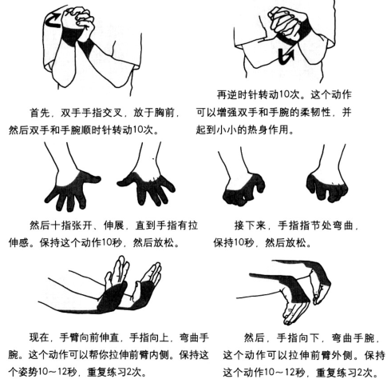
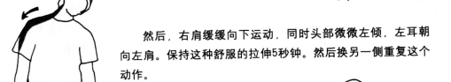
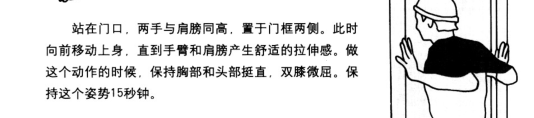
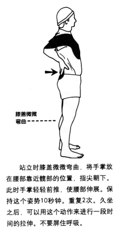
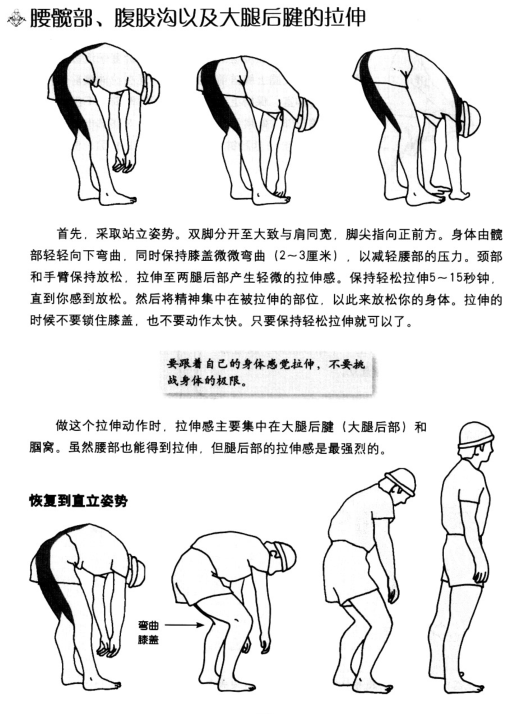
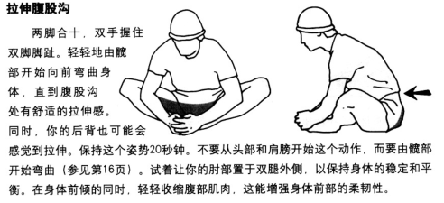
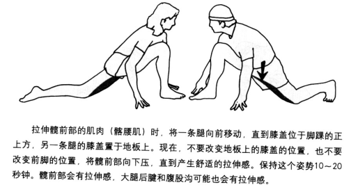
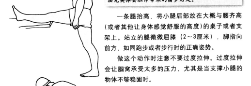
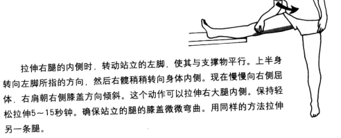

《拉伸：最好的运动》笔记
=======================
拉伸正确的方法是放松的，持续的拉伸，将注意力集中于被拉伸的肌肉上。
动作极快，并且拉伸到身体疼痛的成都——这样的拉伸实际上弊大于利。 
* 轻松拉伸：先花5-15秒进行轻松拉伸，拉伸到有轻微的拉伸张力时，保持这个动作并保持放松。 
* 进阶拉伸：已然不要动作过快，一点点移动身体直到再次感觉到轻微的拉伸张力，保持5-15秒。 
**有痛苦就没有收获，正确的拉伸不会产生任何疼痛感，疼痛意味着什么地方做错了**
## 日常工作拉伸 ##

## 力量训练后拉伸 ##

## 跑步后拉伸 ##

