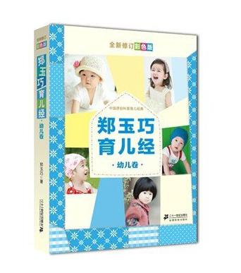

《郑玉巧育儿心经（幼儿卷）》笔记
================

## 12月-13月 ##

独自站立，牵着手可以顺利向前走。

教宝宝时，要反复做三次，第四次让宝宝做。

幼儿不会规避风险，室内需要重新摆设。

幼儿对说话的内容没有深刻的理解，在意的不是说了什么，而是态度和行动。命令和行动对宝宝并没有长期的作用，这是好奇心使然，不必责怪孩子。

拼插玩具和积木适合这个年龄段的宝宝。

通过多种感知进行认知学习。

与孩子对话要简明扼要。

## 13月－14月 ##

可以自由变换身体姿态。

见到陌生人会显出警觉。如果陌生人站在那里不动，面带微笑看着她，或拿好玩的东西给他看，宝宝可能会表现出友好，但仅限于此。如果陌生人试图走近，或去伸手摸他，甚至试图抱她，宝宝可能会转过身，侧过脸，表示不能让陌生人抱。

让宝宝自己吃饭，会增加宝宝的食欲。

放高低不等，大小不同的沙发墩或垫子，让宝宝爬上爬下，不但锻炼了宝宝的运动能力还锻炼了宝宝的智力。

撕纸，玩积木，原地踢球。

语言训练要适度，给孩子说话的机会，并让孩子完成表达。在不断交流中进行训练。与宝宝交流要声音洪亮、清脆。不断纠正宝宝的错误表达会和亲人对宝宝语言行为的过激表现会吓到孩子，会导致孩子沉默不语。如果理解孩子的肢体语言并按照去做，但没有和宝宝进行语言交流，就失去了一次语言学习的机会。

孩子的依赖性主要是为了保证自身安全和自己的探索活动得以顺利完成。

处理孩子发脾气的方式：一个人**单独处理**。先**平静注视**并**等待**，当孩子哭闹减弱在进行**安抚**，当孩子情绪恢复高兴时再开始进行**教育**。

不要让宝宝离开你的视线。

制止孩子的危险行为：先**行动**再**语言**，然后**转移其注意力**

孩子不喜欢吃某种食物，可先改变烹饪方法，如果不奏效可等几天再试，不能一味的喂给宝宝吃。

在孩子面前讲话要谨慎。

有氧运动后，吃一颗糖，会迅速纠正其低血糖状态，也满足了宝宝喜爱吃甜食的嗜好。

两餐之间不要忘记给孩子喂水。幼儿不到渴得不行了的时侯，是不知道要水喝的。每天应给孩子补充四百毫升水。

室温不要超过24度，湿度在50%左右。

发烧在38.5度以下，采用物理降温。超过38.5度服用退烧药，计量为按药品说明书上相应的计量的一半，持续观察十分钟如果温度上升则将另一半也服用。如果还是持续升高则需要就医。
皮肤擦伤，将伤口冲洗干净，消毒，擦干血迹，然后上药。

吸鼻器，清理鼻腔。

