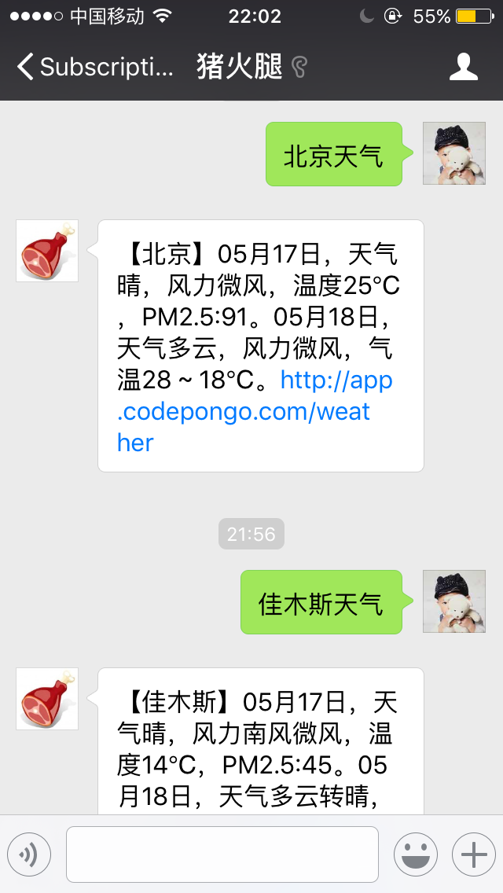
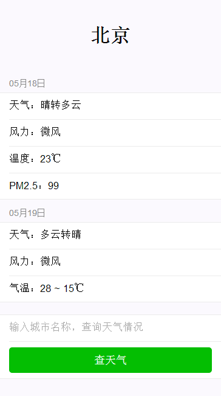

查天气
===============
## 微信公众号支持查天气功能 ##
输入“城市+天气”即可查询当天实时天气和空气质量情况和第二天的天气情况。

扫码关注微信公众账号

## 查天气web应用 ##
访问：[http://app.codepongo.com/weather](http://app.codepongo.com/weather)

在输入框中输入城市名也可以查询天气情况

