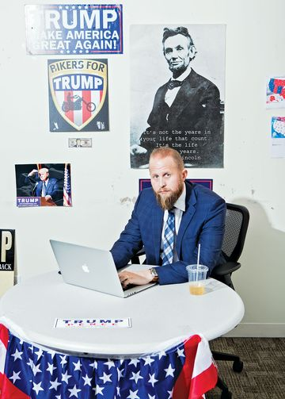
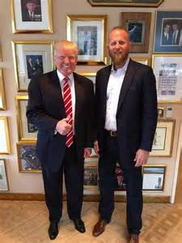

Brad Parscale，Trump 背后的男人
==================================

这位年仅40岁身高6尺8寸的大男孩在德州大学读书时是大学篮球队员，名字叫Brad Parscale。
由于受伤，不能在篮球场上继续发展，毕业后为了赶上网络风潮，他立刻赶到加州，1999年首先做电脑公司的销售员，在大学并不是学计算机专业的他，自学计算机并在加州创业；但2001年网络.com产业泡沫破裂，他不得不在2002回到德州，无钱无工作。
后来开了一家一个人的电脑咨询公司，他逐家逐户拍门找客户，以客户不满意的话，全数退回服务费而在当地出名。
在2011年的一天，川普房地产公司的主管打电话给他，问他是否有兴趣投标为他们的公司设计一个网站，他报价一万元，是最低的报价，于是开始陆续为川普的儿子，女婿的公司设计网站，成为川普一家人的好朋友。当川普刚开始参选时，找他设计竞选网站，他只收了1500美元。
川普赢了初选后，这位非计算机系出身的屌丝被任命为川普竞选团队数码主任digital director. 要知道希拉里的竞选网站可是由前谷歌CEO，创办人之一Eric Schmidt领导一大群矽谷大佬写的，当然不只1500美元。
川普在整个初选都没有筹款，也没有经验怎样筹款，直至得到共和党提名后，才开始搞网络攻势，这个完全没有竞选和政治经验的Brad唯有把竞选当作他为客户做网上销售推广一样做。六月底，他被告知开始做网上筹款，只用了两个星期，他筹了四千万美元。
他并为川普在网上收集支持者的名单，在脸书和多种网络社交平台进行有针对性的广告达十万个，到了10月，他领导着一支超过100人的网站支持团队，带领共和党总部的数码队和Cambridge Analytica，一个月花在网站上的费用高达七千万美元，结果是得到共和党候选人历来最多的网站小额捐款，达二亿七千五百万，还为川普收集到一千二百万到一千四百万的支持者的姓名和通讯联系方法，这些名单将是四年后川普竞选连任和共和党发展党员或票仓的重要资料，他用收集到的支持者的资料，告诉川普在哪个地方演说，预计能吸引多少人到场，通过网上各种途径通知和召集，帮助川普最后两个月在摇摆州的演说集会场场爆满，非常成功，是川普赢下多个摇摆州的重要功臣。

转载自[诗姐八美国政治@新浪微博]()

[原文：http://www.bloomberg.com/news/articles/2016-10-27/inside-the-trump-bunker-with-12-days-to-go](http://www.bloomberg.com/news/articles/2016-10-27/inside-the-trump-bunker-with-12-days-to-go)
