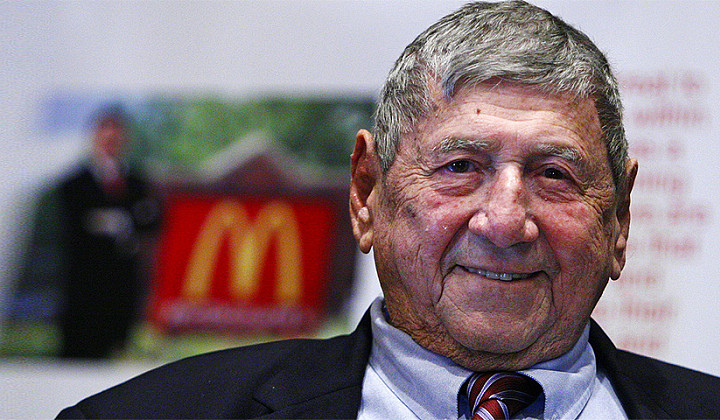

麦当劳巨无霸汉堡的发明者去世了，享年98岁
=======================================

麦当劳“巨无霸”（Big Mac）的创造者Michael James Delligatti（昵称Jim Delligatti）于当地时间11月28日晚在美国匹兹堡郊区的家中去世，享年98岁。

49年前，客人来他店里要求吃大号汉堡，他就发明了巨无霸。之后巨无霸被推广到全球100多个国家，而他自己每周还至少吃一个。

PS：下回再有人推荐什么长寿老人养生秘诀、长寿村里的长寿水之类，请转发此消息给那人一起缅怀一下逝者。

