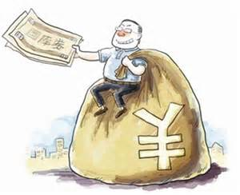
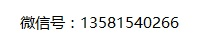

国债逆回购
==================

最近债市流动性钱荒，资金成本开始上涨，逆回购和货基的年化收益率都接近10%，你们有闲钱的可以放债，散户卖出131810，大户卖出204001，都能薅羊毛。

## 什么是国债逆回购 ##
逆回购从本质上讲是一种短期贷款，就是你把钱借给别人，获得固定利息；别人用债券（国债或企业债）作抵押，到期还本付息。

## 国债逆回购的安全性 ##
逆回购的安全性超强，等同于国债。

## 收益 ##
逆回购收益公式为“净收益= 成交金额×年收益率×回购天数/360天- 手续费”

## 交易流程 ##
登录交易系统，选择**卖出**，输入相应的代码和数量即可。
其中，价格表示年化收益率。

特别感谢招商证券客户经理 - 

## 参考 ##
[http://mp.weixin.qq.com/s/uMH90jL86FF8_1VFO1fOwQ](http://mp.weixin.qq.com/s/uMH90jL86FF8_1VFO1fOwQ)
[http://www.newone.com.cn/yybcontroller/zxdetail?id=14358179&code=1008&yybid=100](http://www.newone.com.cn/yybcontroller/zxdetail?id=14358179&code=1008&yybid=100)
