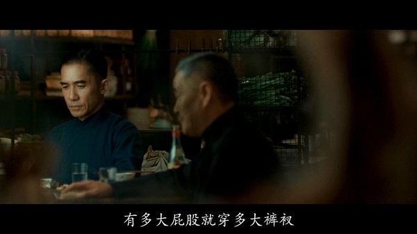
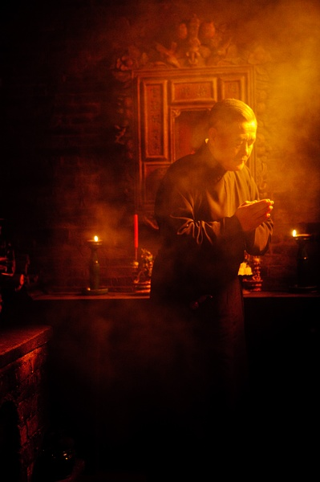

面子与里子
=================

## 人物背景 ##

《一代宗师》中，
赵本山饰演的“大师兄”名叫丁连山，曾为东北八卦门头号人物，后因命案南下佛山。

当年，师弟宫宝森（即片中宫羽田）一直支持革命党，张作霖为剿杀革命党，特意放出一个精神失常的日本武士到街上闹事挑衅，此人名叫薄无鬼，本来醉心革命，使“来华义举”的同志。为了避免更多乡亲无辜受害，决定诛杀之。

丁连山问他：杀人负罪而逃，与独撑门派将一门武艺发扬光大，哪个更难？宫宝森说当然是后者，丁连山说，那好，我做前面这件容易的，更难的就交给你了。杀人之后南逃南粤之地，到了佛山隐姓埋名到了金楼后厨。

数十年后，宮宝森南下，倡议“南北合”，在金楼尝了一碗汤，知道是故人在这，亲自到厨房寻找丁连山。

**一门之中，有人做面子，就得有人做里子。面子请人吃一支烟，里子就得杀一个人。面子不能沾一点灰尘；流了血，里子得收着。收不住，漏到了面子上就是毁派灭门的大事。**

公司，部门和团队都是这样。有人做面子，就得有人做里子。面子吹出去的大话，里子就得圆上。圆不上就是倒闭，解散。

## 参考
[http://i.mtime.com/1588482/blog/7540409/](http://i.mtime.com/1588482/blog/7540409/)

[https://movie.douban.com/review/5733990/](https://movie.douban.com/review/5733990/)
