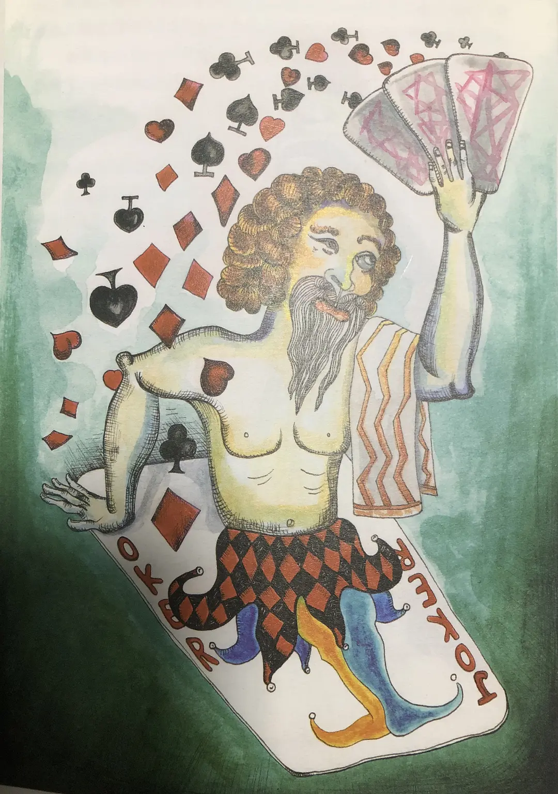

苏格拉底
=============

我对小丑有一种病态的痴迷，这里的小丑不仅仅是DC漫画中的那个Joker，还包括但不限于Harlequin那个经常著名画家笔下的小丑，以及所有与小丑的历史和文化相关的一切。

今天的我想聊的是，哲学上的小丑——苏格拉底。

苏格拉底，西方哲学史上的一个大flag。甚至那古典哲学的一段时期都冠名为苏格拉底，而且更过分的是，在他之前的自然派哲学家们（包括伟大的德谟克利特），都被归为前苏格拉底时期的哲学家。

这家伙有多神奇呢？谜一样的生平经历，死后很快就被誉为许多哲学学派的始祖，各大哲学家们都争先恐后的号称自己是苏格拉底的传人。生平从未写过任何东西，主要的人设都来源于和徒弟柏拉图的对话，色诺芬的语录和阿里斯托芬的剧本。

爸爸是个雕塑家，也可以叫石匠；母亲是个产婆。
苏格拉底是个其貌不扬，不仅长的丑，还不爱洗澡也不换衣服。
据说他有两任老婆，第二任的年纪相差很大，老夫少妻，还是个悍妇。

苏格拉底也说：“男人无论如何都应该结婚，如果你娶到一个好妻子，你会很幸福；如果娶到一个糟糕的妻子，你会成为一个哲学家。”
他自己也评价过他的婚姻，“如果说我老婆是一匹难以驯服的烈马，那我就是一个高级驯马师。我如果能制服这匹烈马，就什么人都能够应对了。”，这应该是最早版的《董小姐》了吧。

没有明确的资料说明，苏格拉底的师傅是谁，也不知道靠什么挣钱。但可以唯一确定的是，苏格拉底并不富裕，而且也不太上进去赚钱，这一生都在广场上衣衫褴褛的瞎几把吹。最为高光的时刻应该就是因为站在广场杀瞎几把吹而被判处死刑了吧。

这个逗逼，在世上的最后一句话竟然是，“克里托，我还欠阿斯克乐皮俄斯一只公鸡，你能记得帮我把这个债还上吗？“

纵观，苏格拉底这一生也像极了一个人或者说神，那神人的名字叫耶稣。。。

能因言获罪，也证明了苏格拉底嘴炮的功力。后来这套话术，被命名为“苏格拉底的反讽”。

这种掰头（battle）的方式是，首先假装无知装傻，然后强迫于聊天对象运用自己的常识思考。

通过辨识和削减那些相互抵触的冲突理论，逐步得到一个更好的假说。

即使今天，苏格拉底这套嘴炮方法的理论思想也在学校和法院，被用于解决复杂性的问题，成为揭示主题和探寻本质性问题的一种方式。我们熟悉的数学中的反证法，第一步正是采取了苏格拉底的这种思想。

简单来说，就是把难题转化为一些列的问题，然后通过问题的答案进一步萃取出对方的观点。提问者和回答者都在这一过程中相互学习到对方观点的含义。因此，苏格拉底会用反例证明断言的不可靠性或者起码是不够的，这导致断言的被修改，然后继续重复上述步骤，不断用反例驳斥断言，促使断言越来越接近真理。

苏格拉底并不是杠精，单纯的为杠而杠也成就不了他的伟大，相反他是典型的刀子嘴豆腐心。
之所以那么爱与人聊天是因为他相信人，相信善良。他认为每个人都存在辨别是非的能力，这个能力存在于理性之中，真正的知识是来自内心，唯有内心的知识才能使人拥有真正的智慧。就像她那个产婆妈妈一样，帮人生出智慧。

理性使人快乐，违反理性就不快乐，世上哪有人会想要成为不快乐的人，苏格拉底像小丑一样，努力的在帮人寻找快乐。

同时，他骨子里是个谦卑的人，认为自己并不是智慧的，只是懂得了追求快乐的方法而已。

戴尔菲神谕，说苏格拉底是世界上最聪明的人。苏格拉底当时就一脸懵逼，为了知道自己是不是最聪明的人，他到处去找聪明人battle，最后发现，在座的聪明人都是垃圾而已。
这个是关于苏格拉底经常被提起的一个故事，我见过的，只把故事写到了这里。

但我的理解是，当苏格拉底发现所谓的聪明人都是垃圾，而自己又被认为是最聪明的人，他当时的心情一定是小丑竟是自己的即视感！

总的来说，他相信灵魂不灭，灵魂是最大的财富，每个人都应该对自己的生命进行审视，通过不断的自我完善。

（完）
